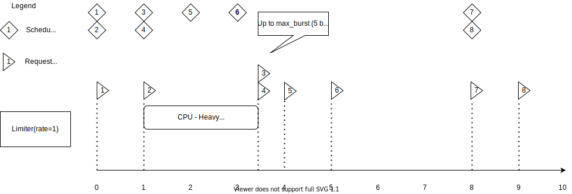
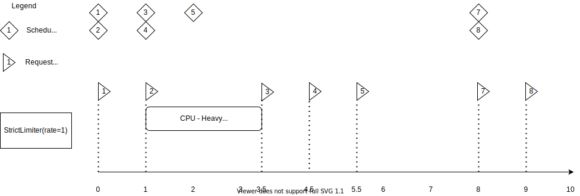
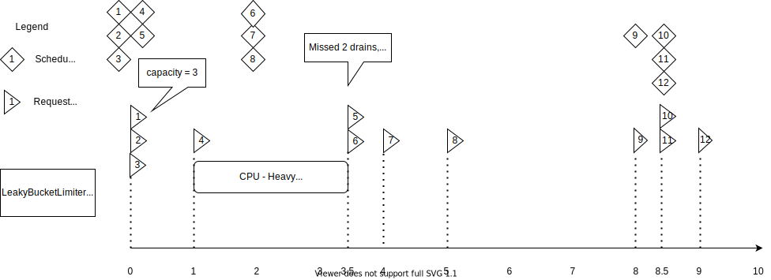

.. You can adapt this file completely to your liking, but it should at least
   contain the root `toctree` directive.

###############################
AsyncIO Rate Limiter for Python
###############################

.. image:: https://img.shields.io/pypi/v/asynciolimiter
    :alt: PyPI
    :target: https://pypi.org/project/asynciolimiter/
.. image:: https://img.shields.io/pypi/pyversions/asynciolimiter
    :alt: Versions
    :target: https://pypi.org/project/asynciolimiter/
.. image:: https://img.shields.io/pypi/l/asynciolimiter
    :alt: PyPI License
    :target: https://github.com/bharel/asynciolimiter/blob/master/LICENSE
.. image:: https://codecov.io/gh/bharel/asynciolimiter/branch/master/graph/badge.svg?token=BJBL909NH3
    :target: https://codecov.io/gh/bharel/asynciolimiter
.. image:: https://img.shields.io/github/checks-status/bharel/asynciolimiter/master
    :target: https://github.com/bharel/asynciolimiter
.. image:: https://img.shields.io/github/stars/bharel/asynciolimiter?style=social
    :target: https://github.com/bharel/asynciolimiter

.. toctree::
   :maxdepth: 2
   :caption: Contents:

A simple rate limiting module, containing 3 different algorithms for
limiting:

    - :class:`Limiter`: Limits by requests per second and takes into account
        CPU heavy tasks or other delays that can occur while the
        process is sleeping.
    - :class:`LeakyBucketLimiter`: Limits by requests per second according to the
        `leaky bucket algorithm <https://en.wikipedia.org/wiki/Leaky_bucket>`_. Has a maximum
        capacity and an initial burst of requests.
    - :class:`StrictLimiter`: Limits by requests per second, without taking CPU or
        other process sleeps into account. There are no bursts and
        the resulting rate will always be a less than the set limit.

If you don't know which of these to choose, go for the regular :class:`Limiter`.

**************
Example usage:
**************

.. code::
    
    import asyncio
    from asynciolimiter import Limiter

    # Limit to 10 requests per 5 second (equiv to 2 requests per second)
    rate_limiter = Limiter(10/5)

    async def request():
        await rate_limiter.wait() # Wait for a slot to be available.
        print("hello world") # do stuff

    async def main():
        await asyncio.gather(*(request() for _ in range(10)))

    asyncio.run(main())

Alternatively, you can wrap coroutines using :meth:`~Limiter.wrap`:

.. code::
    
    import asyncio
    from asynciolimiter import Limiter

    # Limit to 1 request per 3 second
    rate_limiter = Limiter(1/3)

    async def request():
        print("hello world") # do stuff

    async def main():
        await asyncio.gather(*(rate_limiter.wrap(request()) for _ in range(10)))

    asyncio.run(main())

****************
Installation
****************

Install from `PyPi <https://pypi.org/project/asynciolimiter/>`_:

    ``pip install asynciolimiter``

****************
Comparisons
****************

What is the difference between the 3 algorithms?

It is best explained using a timeline:

Limiter is accurate and does not cause any burst unless delayed. It does not
save any "empty" ticks for later. For most cases it's ideal, but will
be slower for sporadic bursts.

StrictLimiter is good for when the endpoints are strictly limited, and you're
unable to send more than X requests per second in any given timeframe.

LeakyBucket works well for sporadic bursts of data should the endpoint
support it, yet still limit the requests up to a certain maximum over
a longer timeframe. Setting the capacity to a reasonable value is important
to ensure smooth traffic.

****************
Implementations
****************

.. class:: Limiter(rate, *, max_burst = 5)

    Regular limiter, with a max burst compensating for delayed schedule.
    
    Takes into account CPU heavy tasks or other delays that can occur while
    the process is sleeping.

    Receives *rate* as the average calls per second at which the limiter should
    let traffic through.

    Sample usage:

    .. code::
        
        >>> limiter = Limiter(1/2)  # 1 call per 2 seconds.
        >>> async def main():
        ...     print_numbers = (foo(i) for i in range(10))
        ...     # This will print the numbers over 20 seconds
        ...     await asyncio.gather(*map(limiter.wrap, print_numbers))

    Alternative usage:

    .. code::

        >>> # 5 calls per second; up to 10 calls at once if there's a delay
        >>> limiter = Limiter(5, max_burst=10)
        >>> async def request():
        ...     await limiter.wait()
        ...     print("Request")  # Do stuff
        ...
        >>> async def main():
        ...     # Schedule 5 requests per second.
        ...     await asyncio.gather(*(request() for _ in range(10)))
    
    Has the following attributes:

    .. attribute:: rate

        The rate (calls per second) at which the limiter should let traffic
        through.
    
    .. attribute:: max_burst

        In case there's a delay, schedule no more than this many
        calls at once. Defaults to ``5``.

    Has the following methods:

    .. method:: wait()
        :async:

        Wait for the limiter to let us through.

        Main function of the limiter. Blocks if limit has been reached, and 
        lets us through once time passes.

        
    .. method:: wrap(coro)

        Wrap a coroutine with the limiter.

        *coro* can be any :class:`~typing.Awaitable` to be wrapped.

        Returns a new coroutine that waits for the limiter to be unlocked, and
        then schedules the original coroutine.

        Equivalent to::

            >>> async def wrapper():
            ...     await limiter.wait()
            ...     return await coro
            ...
            >>> wapper()
        
        Example use::

            >>> async def foo(number):
            ...     print(number)  # Do stuff
            ...
            >>> limiter = Limiter(1)
            >>> async def main():
            ...     print_numbers = (foo(i) for i in range(10))
            ...     # This will print the numbers over 10 seconds
            ...     await asyncio.gather(*map(limiter.wrap, print_numbers))
    
    .. method:: cancel()

        Cancel all waiting calls.

        This will cancel all currently waiting calls.
        Limiter is reusable afterwards, and new calls will wait as usual.

    .. method:: breach()

        Let all calls through.
        
        All waiting calls will be let through, new :meth:`wait` calls will also
        pass without waiting, until :meth:`reset` is called.

    .. method:: reset()

        Reset the limiter.

        This will cancel all waiting calls, reset all internal timers, and
        restore the limiter to its initial state.
        Limiter is reusable afterwards, and the next call will be 
        immediately scheduled.

.. class:: StrictLimiter(rate)

    A stricter version of :class:`Limiter`.

    Limits by a **maximum** number of requests per second.
    
    Does not compensate for missed requests, and thus has no bursts.

    Receives *rate* as the max calls per second at which the limiter should let
    traffic through.

    Sample usage:

    .. code::
        
        >>> limiter = StrictLimiter(1/2)  # up to 1 call per 2 seconds.
        >>> async def main():
        ...     print_numbers = (foo(i) for i in range(10))
        ...     # This will print the numbers over 20 seconds
        ...     await asyncio.gather(*map(limiter.wrap, print_numbers))

    Alternative usage:

    .. code::

        >>> limiter = StrictLimiter(5)  # up to 5 calls per second.
        >>> async def request():
        ...     await limiter.wait()
        ...     print("Request")  # Do stuff
        ...
        >>> async def main():
        ...     # Schedule 5 requests per second.
        ...     await asyncio.gather(*(request() for _ in range(10)))
    
    Has the following attributes:

    .. attribute:: rate

        The maximum rate (calls per second) at which the limiter should let
        traffic through.

    Has the following methods:

    .. method:: wait()
        :async:

        See :meth:`Limiter.wait`.

        
    .. method:: wrap(coro)

        See :meth:`Limiter.wrap`.
    
    .. method:: cancel()

        See :meth:`Limiter.cancel`.

    .. method:: breach()

        See :meth:`Limiter.breach`.

    .. method:: reset()

        See :meth:`Limiter.reset`.

.. class:: LeakyBucketLimiter(rate, *, capacity = 10)

    Leaky bucket compliant limiter with bursts.

    Limits by requests per second according to the leaky bucket algorithm.
    Has a maximum capacity and an initial burst of requests.

    Receives *rate* as the calls per second at which the bucket should "drain"
    or let calls through.
    
    *capacity* is the maximum number of requests that can pass through until
    the bucket is full. Defaults to 10.

    Sample usage:

    .. code::
        
        >>> limiter = LeakyBucketLimiter(1, capacity=5)
        >>> async def main():
        ...     print_numbers = (foo(i) for i in range(10))
        ...     # This will print the numbers 0,1,2,3,4 immidiately, then
        ...     # wait for a second before each remaining number.
        ...     await asyncio.gather(*map(limiter.wrap, print_numbers))
        ...     # After 5 seconds of inactivity, bucket will drain back to empty.

    Alternative usage:

    .. code::

        >>> limiter = LeakyBucketLimiter(5)  # capacity is 10 by default.
        >>> async def request():
        ...     await limiter.wait()
        ...     print("Request")  # Do stuff
        ...
        >>> async def main():
        ...     # First 10 requests would be immediate, then schedule 5
        ...     # requests per second. Total time - 2 seconds.
        ...     await asyncio.gather(*(request() for _ in range(20)))
    
    Has the following attributes:

    .. attribute:: rate

        The maximum rate (calls per second) at which the limiter should let
        traffic through.
    
    .. attribute:: capacity
        
        The maximum number of requests that can pass through until the bucket is
        full. Defaults to 10.

    Has the following methods:

    .. method:: wait()
        :async:

        See :meth:`Limiter.wait`.

        
    .. method:: wrap(coro)

        See :meth:`Limiter.wrap`.
    
    .. method:: cancel()

        See :meth:`Limiter.cancel`.

        Does not drain the bucket.

    .. method:: breach()

        See :meth:`Limiter.breach`.

    .. method:: reset()

        See :meth:`Limiter.reset`.

        Also drains the bucket to empty.

Issues, Feature requests & Contributions
----------------------------------------

See our `Github <https://github.com/bharel/asynciolimiter>`_ :-)

Indices and tables
------------------

* :ref:`genindex`
* :ref:`search`
